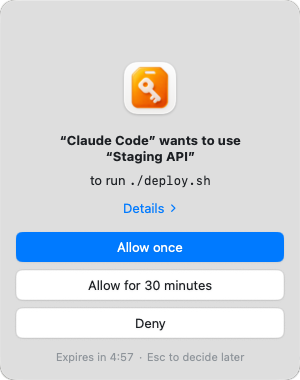
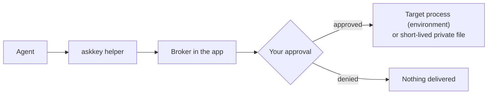
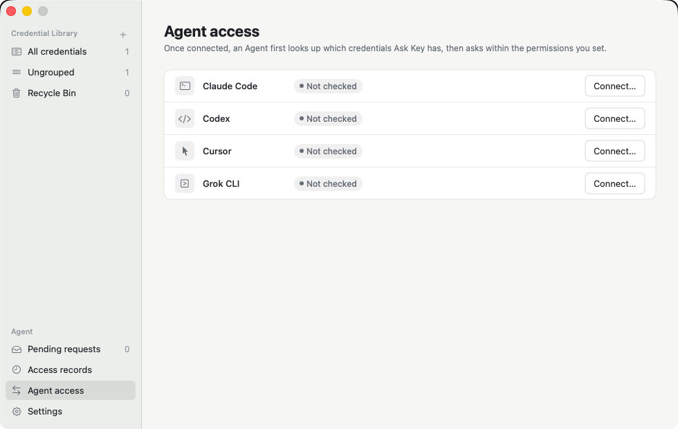

# AskKey

[](https://github.com/sudoHG/AskKey/actions/workflows/ci.yml) [](https://github.com/sudoHG/AskKey/releases/latest) [](https://github.com/sudoHG/AskKey/releases) [](#install) [](https://github.com/sudoHG/AskKey/stargazers) [](LICENSE) [](https://hits.sh/github.com/sudoHG/AskKey/)

A macOS menu bar app that keeps your credentials encrypted on your Mac and lets AI agents use them only after you approve.

English | [Simplified Chinese](README.zh-CN.md)

> **[Download the latest release](https://github.com/sudoHG/AskKey/releases/latest)** (notarized DMG, macOS 14+). Version 0.1 has no backup or recovery, so keep the originals of your credentials somewhere else.

<p align="center">
  
</p>

## Why it exists

Coding agents need real secrets to deploy code, call APIs or log in to servers. The usual shortcuts are pasting a key into a chat, writing it into a prompt or leaving it in a `.env` file. Each of those hands plaintext to every tool, transcript and log that can read it, and you rarely see which agent used what.

AskKey takes the secret out of that path. The agent never holds the stored value. It asks, you decide, and the value goes only to the program that needs it.

## Install

1. Download `AskKey-<version>.dmg` and `AskKey-<version>.dmg.sha256` from the [latest release](https://github.com/sudoHG/AskKey/releases/latest). Replace `<version>` below with the downloaded version.
2. In the download directory, verify the checksum before opening the DMG:

   ```bash
   shasum -a 256 -c AskKey-<version>.dmg.sha256
   ```

   Continue only if the check reports `OK`.
3. Open the DMG and drag `Ask Key.app` into Applications. It must stay at exactly `/Applications/Ask Key.app`, under that name, or agents cannot connect.
4. Launch Ask Key and follow the three steps below.

To upgrade or remove it later, see [Upgrade](#upgrade) and [Uninstall](#uninstall).

### Start in three steps

The welcome page walks you through the same steps.

1. **Store a credential.** Choose **New Credential**, or **Import from File…** to bring in a `.env` file. New credentials default to **Ask every time**.
2. **Connect your Agent.** Open the **Agent access** page and choose **Connect…** next to Claude Code, Codex, Cursor or Grok CLI. See [Supported clients](#supported-clients).
3. **Try it once.** Ask your Agent something like "Use Staging API from Ask Key to run `./deploy.sh`". Ask Key shows an approval prompt; choose **Allow once**. The Agent sees the command's output, never the value, and the use appears in **Access records**.

## How it works

AskKey stores text credentials (API keys, tokens, passwords) and files (SSH keys, `.p8`, PEM, service-account JSON). One credential can have several parts, each mapped to an environment variable name. You add credentials by hand or import a `.env` file in the app.



An agent first reads a catalog of credential names, usage instructions and variable mappings. The catalog never contains values. When the agent needs a credential, it runs its command through the helper, and the Broker inside the app decides whether to ask you. After approval, text parts become environment variables of the target process, and file parts are written to a random file in a private directory that is removed after a short time. The agent gets the target's output (through the helper) or just its exit status (through MCP), never the stored value.

```bash
askkey run --wait-for-approval \
  --credential "Staging API" \
  --operation-id deploy-001 \
  --caller-name "Codex" --caller-purpose "Deploy staging" \
  -- ./deploy.sh
```

The helper ships inside the app bundle at `Contents/Helpers/askkey`. The target gets only the selected credentials, under the variable names set on each part, plus a filtered copy of the inherited environment.

## Permissions

Each credential has one permission:

| Permission | Effect on agents |
|---|---|
| Allow | Agents can use it without a prompt. Delivery still goes through the Broker. |
| Ask every time (default) | Every use waits for your approval. |
| Hidden | Not in the agent catalog; agents cannot request it. |

When you approve a read, you choose **Once** or a **Timed allowance**: a number of minutes during which that credential can be read without asking again, until it ends or you revoke it. Pending requests expire after five minutes.

Agent writes (create, modify, delete) always need approval for that single operation. The approval is tied to the exact content you were shown and cannot be reused for another change. Permanent deletion stays in the app.

## Supported clients



Claude Code, Codex, Cursor and Grok CLI. Open the app's **Agent access** page, check a client, then confirm. For each client, setup:

- adds AskKey as an MCP server in the user-level configuration, keeping a private backup and your other settings;
- installs a discovery hook that reminds the agent to look up the catalog before common direct SSH commands;
- verifies the configuration, the bundled helper and the Broker before it reports the client as connected.

Setup runs only when you ask for it, and writing a client's configuration needs system authentication. Discovery hooks are reminders, not authorization.

### Other MCP clients

Any client that supports standard MCP stdio servers can connect to AskKey by defining a server with:

- `command`: `/Applications/Ask Key.app/Contents/Helpers/askkey`
- `args`: `["mcp"]`

Manual setup does not include automatic discovery reminders before SSH commands or connection verification in the app. Broker permissions, approval prompts, and credential delivery protections still apply.

## Security model

The full policy, including how to report a vulnerability privately, is in [SECURITY.md](SECURITY.md). In short:

- Credentials are encrypted locally. Responses from AskKey's management, MCP and helper interfaces do not contain stored plaintext.
- Revealing or copying a stored value in the app requires fresh system authentication.
- Revoking, expiring or pausing stops deliveries that have not started and cleans up temporary files.

What AskKey does not guarantee:

- An approved target can print, copy or forward what it receives.
- Caller names and purposes are declared by the agent. They help you read a request; they are not verified identity.
- Another process running as the same macOS user may be able to read material after an approved delivery. Hidden keeps a credential out of the agent catalog but does not defend against that.
- A timed allowance covers the credential for the whole local user, not one agent client.

## Upgrade

Quit Ask Key, download and verify the new DMG as described in [Install](#install), then replace `/Applications/Ask Key.app` with the app from the new DMG and relaunch. Your credential library and settings are kept. Watch [GitHub Releases](https://github.com/sudoHG/AskKey/releases) for new versions; there is no automatic update.

## Uninstall

Quit Ask Key and delete `/Applications/Ask Key.app`. For each connected client, remove only the AskKey entries and owned files listed in [What setup writes](docs/client-integrations.md#what-setup-writes), including MCP configuration, discovery Hooks and AskKey-specific Hook trust settings (for example, for Claude Code, run `claude mcp remove askkey --scope user` and remove AskKey handlers from `~/.claude/settings.json`). Preserve unrelated client settings and Hooks. There is no in-app way to disconnect a client.

You can optionally erase the local credential library as well. **This permanently destroys all stored credentials and cannot be undone; v0.1 has no backup or recovery.** To do so, delete `~/Library/Application Support/AskKey` and use Keychain Access to delete the keychain item with service `com.sudohg.askkey.vault`.

## Build from source

Requirements: macOS 14 or later, and Xcode with a Swift 6 toolchain.

```bash
swift build
swift test
make run
```

`make run` builds a Debug app and starts it with separate development data, key material and socket, so it never touches an installed copy of AskKey. Use synthetic credentials when trying it out. See [CONTRIBUTING.md](CONTRIBUTING.md) for the full requirements, UI test flow and pull request checks.

## Documentation

The [documentation index](docs/README.md) lists every guide and architecture decision. To find your way around the code, start with the [architecture guide](docs/architecture.md); [testing.md](docs/testing.md) explains the local checks and the desktop flows that run in CI.

## License and credits

MIT. See [LICENSE](LICENSE) and [NOTICE](NOTICE). AskKey started as a fork of [Lokalite](https://github.com/RubenGlez/lokalite) by Ruben González Alonso; the product and most of the code have since been rewritten. The Chinese product name is 请旨.
