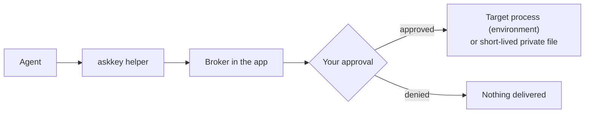

# AskKey

A macOS menu bar app that keeps your credentials encrypted on your Mac and lets AI agents use them only after you approve.

English | [简体中文](README.zh-CN.md)

> **Status:** AskKey is being restructured before its first public release. There is no installer yet; build it from source. Version 0.1 has no backup or recovery, so keep the originals of your credentials somewhere else.

## Why it exists

Coding agents need real secrets to deploy code, call APIs or log in to servers. The usual shortcuts are pasting a key into a chat, writing it into a prompt or leaving it in a `.env` file. Each of those hands plaintext to every tool, transcript and log that can read it, and you rarely see which agent used what.

AskKey takes the secret out of that path. The agent never holds the stored value. It asks, you decide, and the value goes only to the program that needs it.

## How it works

AskKey stores text credentials (API keys, tokens, passwords) and files (SSH keys, `.p8`, PEM, service-account JSON). One credential can have several parts, each mapped to an environment variable name. You add credentials by hand or import a `.env` file in the app.



An agent first reads a catalog of credential names, usage instructions and variable mappings. The catalog never contains values. When the agent needs a credential, it runs its command through the helper, and the Broker inside the app decides whether to ask you. After approval, text parts become environment variables of the target process, and file parts are written to a random file in a private directory that is removed after a short time. The agent gets the target's output (through the helper) or just its exit status (through MCP), never the stored value.

```bash
askkey run --wait-for-approval \
  --credential "Staging API" \
  --operation-id deploy-001 \
  --caller-name "Codex" --caller-purpose "Deploy staging" \
  -- ./deploy.sh
```

The helper ships inside the app bundle at `Contents/Helpers/askkey`. The target gets only the selected credentials, under the variable names set on each part, plus a filtered copy of the inherited environment.

## Permissions

Each credential has one permission:

| Permission | Effect on agents |
|---|---|
| Allow | Agents can use it without a prompt. Delivery still goes through the Broker. |
| Ask (default) | Every use waits for your approval. |
| Hidden | Not in the agent catalog; agents cannot request it. |

When you approve a read, you choose **Once** or a **Timed allowance**: a number of minutes during which that credential can be read without asking again, until it ends or you revoke it. Pending requests expire after five minutes.

Agent writes (create, modify, delete) always need approval for that single operation. The approval is tied to the exact content you were shown and cannot be reused for another change. Permanent deletion stays in the app.

## Supported clients

Codex, Cursor and Grok CLI. Open the app's **Agent access** page, check a client, then confirm. For each client, setup:

- adds AskKey as an MCP server in the user-level configuration, keeping a private backup and your other settings;
- installs a discovery hook that reminds the agent to look up the catalog before common direct SSH commands;
- verifies the configuration, the bundled helper and the Broker before it reports the client as connected.

Setup runs only when you ask for it, and writing a client's configuration needs system authentication. Discovery hooks are reminders, not authorization.

## Security model

The full policy, including how to report a vulnerability privately, is in [SECURITY.md](SECURITY.md). In short:

- Credentials are encrypted locally. Responses from AskKey's management, MCP and helper interfaces do not contain stored plaintext.
- Revealing or copying a stored value in the app requires fresh system authentication.
- Revoking, expiring or pausing stops deliveries that have not started and cleans up temporary files.

What AskKey does not guarantee:

- An approved target can print, copy or forward what it receives.
- Caller names and purposes are declared by the agent. They help you read a request; they are not verified identity.
- Another process running as the same macOS user may be able to read material after an approved delivery. Hidden keeps a credential out of the agent catalog but does not defend against that.
- A timed allowance covers the credential for the whole local user, not one agent client.

## Build from source

Requirements: macOS 14 or later, and Xcode with a Swift 6 toolchain.

```bash
swift build
swift test
make run
```

`make run` builds a Debug app and starts it with separate development data, key material and socket, so it never touches an installed copy of AskKey. Use synthetic credentials when trying it out. See [CONTRIBUTING.md](CONTRIBUTING.md) for the full requirements, UI test flow and pull request checks.

## License and credits

MIT. See [LICENSE](LICENSE) and [NOTICE](NOTICE). AskKey started as a fork of [Lokalite](https://github.com/RubenGlez/lokalite) by Ruben González Alonso; the product and most of the code have since been rewritten. The Chinese product name is 请旨.
