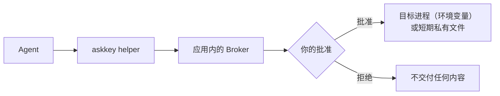

# AskKey（请旨）

[](https://github.com/sudoHG/AskKey/actions/workflows/ci.yml) [](https://github.com/sudoHG/AskKey/releases/latest) [](https://github.com/sudoHG/AskKey/releases) [](#安装) [](https://github.com/sudoHG/AskKey/stargazers) [](LICENSE) [](https://hits.sh/github.com/sudoHG/AskKey/)

一个 macOS 菜单栏应用：凭证加密保存在你的 Mac 上，AI Agent 必须经过你的批准才能使用。

[English](README.md) | 简体中文

> **[下载最新版本](https://github.com/sudoHG/AskKey/releases/latest)**（经过 Apple 公证的 DMG，需要 macOS 14 或更高版本）。v0.1 没有备份和恢复功能，请自行另存一份凭证原件。

## 为什么需要它

编码 Agent 要部署代码、调用 API、登录服务器，就得用到真实的密钥。常见做法是把 key 贴进对话、写进提示词，或者留在 `.env` 文件里。这等于把明文交给每一个能读到它的工具、聊天记录和日志，而你往往不知道哪个 Agent 用了什么。

AskKey 把密钥从这条路径里拿出来：Agent 手里没有保存的凭证值，它只能提出请求，由你决定，值只交给真正需要它的那个程序。

## 安装

1. 从[最新版本](https://github.com/sudoHG/AskKey/releases/latest)下载 `AskKey-<version>.dmg` 和 `AskKey-<version>.dmg.sha256`。执行下面的命令前，将 `<version>` 替换为下载的版本号。
2. 在下载目录中校验文件，确认无误后再打开 DMG：

   ```bash
   shasum -a 256 -c AskKey-<version>.dmg.sha256
   ```

   只有校验结果为 `OK` 时才继续。
3. 打开 DMG，将 `Ask Key.app` 拖入 Applications（应用程序）。应用必须保留原名，并始终位于 `/Applications/Ask Key.app`，否则 Agent 无法连接。
4. 启动请旨，在 **Agent 接入**页面连接客户端。详见[支持的客户端](#支持的客户端)。

以后升级或卸载，见[升级](#升级)和[卸载](#卸载)。

## 工作方式

AskKey 可以保存文本凭证（API key、token、密码）和文件（SSH 私钥、`.p8`、PEM、服务账号 JSON）。一份凭证可以包含多项内容，每一项映射到一个环境变量名。你可以在应用里手动添加，也可以导入 `.env` 文件。



Agent 先读取凭证目录，里面只有凭证名称、使用说明和变量映射，没有任何值。需要用某份凭证时，Agent 通过 helper 运行命令，应用内的 Broker 判断是否要请你批准。批准后，文本内容会成为目标进程的环境变量，文件内容会写入私有目录里的随机文件，并在短时间后删除。Agent 拿到的是目标程序的输出（通过 helper 调用时）或退出状态（通过 MCP 调用时），永远拿不到已保存的凭证值。

```bash
askkey run --wait-for-approval \
  --credential "Staging API" \
  --operation-id deploy-001 \
  --caller-name "Codex" --caller-purpose "Deploy staging" \
  -- ./deploy.sh
```

helper 位于应用包内的 `Contents/Helpers/askkey`。目标进程只会拿到被选中的凭证（按每一项设置的变量名），外加一份经过过滤的继承环境。

## 权限

每份凭证有一个权限：

| 权限 | 对 Agent 的效果 |
|---|---|
| 允许 | Agent 可以直接使用，不再弹窗。交付仍然经过 Broker。 |
| 每次询问（默认） | 每次使用都要等你批准。 |
| 隐藏 | 不出现在 Agent 目录里，Agent 无法请求。 |

批准读取时，你可以选择“仅本次”或“限时允许”：在设定的分钟数内，这份凭证可以不再询问直接读取，到期或被你撤销后失效。待处理的请求 5 分钟后过期。

Agent 的写操作（新建、修改、删除）永远要对每一次操作单独批准。批准绑定的是你看到的那份具体内容，不能挪用到另一次修改上。永久删除只能在应用里进行。

## 支持的客户端

Codex、Cursor 和 Grok CLI。在应用的 Agent 接入页面里先检查某个客户端，再确认连接。对每个客户端，接入会：

- 在用户级配置里把 AskKey 添加为 MCP server，同时保留私有备份，不动你的其他设置；
- 安装一个发现 hook，在 Agent 直接执行常见 SSH 命令之前，提醒它先查询凭证目录；
- 验证配置、内置 helper 和 Broker 都正常之后，才显示“已验证连接”。

接入只在你主动操作时运行，写入客户端配置需要系统验证。发现 hook 只是提醒，不是授权。

## 安全模型

完整政策（包括如何私下报告漏洞）见 [SECURITY.md](SECURITY.md)。简要来说：

- 凭证在本机加密保存。AskKey 的管理、MCP 和 helper 响应都不会返回已保存的明文。
- 在应用里查看或复制凭证值，需要重新做系统验证。
- 撤销、到期或暂停会阻止尚未开始的交付，并清理临时文件。

AskKey 不保证的事：

- 获准的目标程序可以把收到的内容打印、复制或转发出去。
- 调用方名称和用途由 Agent 自行声明，只是帮你看懂请求，不是经过验证的身份。
- 同一 macOS 用户下的其他进程，可能在交付之后读取到相关内容。“隐藏”只是让凭证不进入 Agent 目录，防不住这类旁路。
- 限时允许针对的是整个本机用户下的这份凭证，而不是某一个 Agent 客户端。

## 升级

退出请旨，按[安装](#安装)中的步骤下载并校验新版 DMG，用其中的应用替换 `/Applications/Ask Key.app`，然后重新启动。凭证库和设置会保留。请关注 [GitHub Releases](https://github.com/sudoHG/AskKey/releases) 获取新版本；应用没有自动更新功能。

## 卸载

退出请旨并删除 `/Applications/Ask Key.app`。对每个已连接的客户端，只移除 [What setup writes](docs/client-integrations.md#what-setup-writes) 中列出的 AskKey 配置项和专属文件，包括 MCP 配置、凭证查询 Hook 和 AskKey 专属的 Hook 信任设置，保留其他客户端设置和 Hook。应用内没有断开客户端连接的功能。

你也可以选择一并删除本机凭证库。**这会永久销毁所有已保存的凭证，无法撤销；v0.1 没有备份和恢复功能。** 如需删除，请移除 `~/Library/Application Support/AskKey` 目录，并在“钥匙串访问”中删除服务名为 `com.sudohg.askkey.vault` 的钥匙串项目。

## 从源码构建

要求：macOS 14 或更高版本，以及带 Swift 6 工具链的完整 Xcode。

```bash
swift build
swift test
make run
```

`make run` 会构建 Debug 版应用，并使用独立的开发数据、密钥材料和 socket 启动，不会碰已安装的 AskKey。试用时请使用合成凭证。完整要求、UI 测试流程和 PR 检查见 [CONTRIBUTING.md](CONTRIBUTING.md)。

## 文档

[文档索引](docs/README.md)列出了全部指南和架构决策。想了解代码结构，可以从[架构指南](docs/architecture.md)读起；[testing.md](docs/testing.md) 说明本地检查，以及在 CI 中运行的桌面流程。文档正文为英文。

## 许可证与致谢

MIT 许可，见 [LICENSE](LICENSE) 和 [NOTICE](NOTICE)。AskKey 最初是 [Lokalite](https://github.com/RubenGlez/lokalite)（作者 Ruben González Alonso）的 fork，之后产品形态和大部分代码已经重写。
